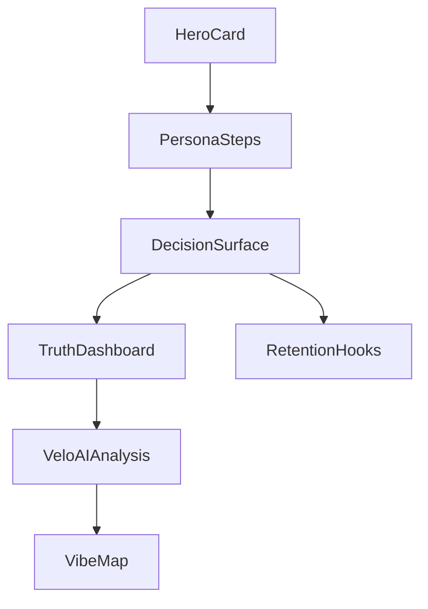

# Design System — Velo / VibeCheck

## Marka

- **Ürün adı:** Velo (AI analiz kartı), VibeCheck (seyahat prototype)
- **Ton:** Güvenilir, sade, mobile-first
- **Pilot:** Londra seyahat kararları

## Renk Paleti

### VibeCheck (Ana Uygulama)

| Token | Değer | Kullanım |
|-------|-------|----------|
| `primary` | `#2563eb` | CTA, aktif chip |
| `primary-soft` | `#dbeafe` | Hover, arka plan vurgu |
| `surface` | `#ffffff` | Kart, panel |
| `line` | `#e2e8f0` | Kenarlık |
| `muted` | `#64748b` | İkincil metin |
| `text` | `#0f172a` | Başlık, gövde |

Kaynak: `frontend/src/design-system/tokens.css`, `frontend/src/index.css`

### Velo Analiz Kartı

| Token | Değer | Kullanım |
|-------|-------|----------|
| `--beach-bg` | `#f4f7f6` | Sayfa arka planı |
| `--sea-blue` | `#0284c7` | Skor, logo vurgu |
| `--sunset-orange` | `#f97316` | Öncelik kartı border |
| `--text-dark` | `#1e293b` | Başlık |
| `--text-light` | `#64748b` | Alt metin |
| `--card-bg` | `#ffffff` | Kart yüzeyi |

Kaynak: `frontend/src/components/HotelAnalysisCard.css`

## Tipografi

- **Font stack:** `-apple-system, BlinkMacSystemFont, 'Segoe UI', Inter, system-ui, sans-serif`
- **Hero (h1):** ~1.75rem, bold, mobile-first
- **Panel (h2):** ~1.25rem, section başlığı
- **Card (h3):** ~1rem, kart başlığı
- **Body:** 1rem / 0.95rem, line-height 1.5
- **Muted / eyebrow:** 0.85rem, uppercase veya secondary renk

## Spacing ve Radius

- **Grid:** 8px taban (0.5rem ritim)
- **Kart radius:** 14–24px (`border-radius: 14px` VibeCheck, `24px` Velo container)
- **Chip / pill:** `999px` (tam yuvarlak)
- **Panel padding:** 1rem–1.5rem mobil, 2rem tablet+

## Bileşen Kuralları

| Bileşen | Sınıf | Kurallar |
|---------|-------|----------|
| Hero | `.hero-card` | Ürün bağlamı, tek sütun |
| Panel | `.panel` | Akış bölümü gruplama |
| Kart | `.card`, `.score-card` | İçerik modülü, gölge hafif |
| Chip | `.chip`, `.chip-active` | Filtre/adım; `button` semantiği |
| CTA | `.cta-button`, `.analyze-button` | Birincil aksiyon; disabled state |
| Otel sekmesi | `.hotel-tab` | Senaryo geçişi |
| Skor rozeti | `.score-badge`, `.small-score` | 1–10 skala, mavi vurgu |
| Hata | `.error-text` | Kırmızı `#dc2626` |

## Etkileşim

- Tüm tıklanabilir öğeler `<button type="button">`
- Aktif state: border veya arka plan değişimi (`chip-active`, `hotel-tab-active`)
- Focus: kontrastlı border (accessibility)
- Loading: buton metni “Analiz Ediliyor...”, disabled

## Responsive

- **Varsayılan:** Tek sütun (mobile-first)
- **Tablet (≥768px):** `.grid.two-col` iki sütun
- **Velo skor grid:** `repeat(auto-fit, minmax(240px, 1fr))`

## Wireflow

Detay: `frontend/docs/design-system-wireflow.md`
