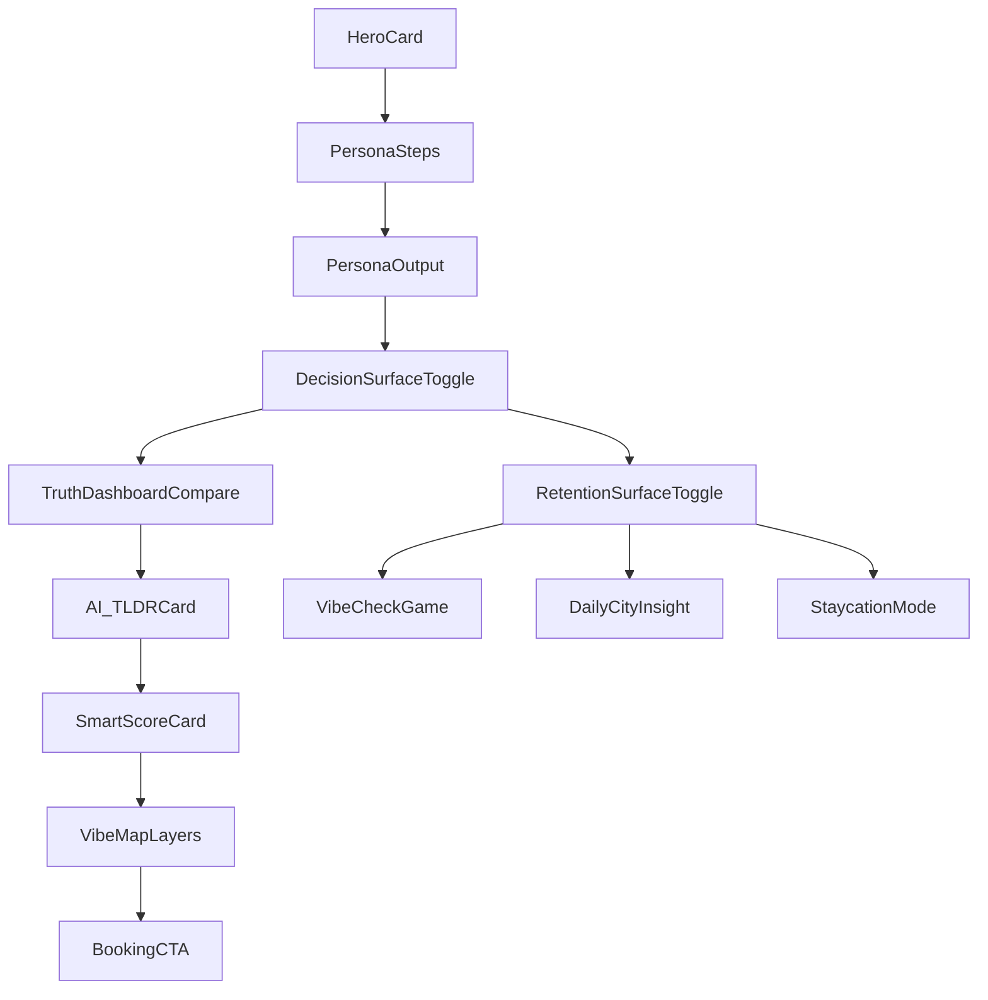

# Mobile-First Design System and Wireflow

## Design Tokens
- Colors: `primary`, `primary-soft`, `surface`, `line`, `muted`, `text`.
- Radius: `14px` for cards, `999px` for pills/chips.
- Spacing: 8px grid (0.5rem based rhythm).
- Typography: Inter/system sans, compact mobile hierarchy.

## Core Components
- `hero-card`: product context and value proposition.
- `panel`: grouped flow sections.
- `card`: semantic content module.
- `chip`: interactive filter/step controls.
- `hotel-tab`: quick hotel scenario switch.
- `cta-button`: primary and secondary action styles.
- `badge`: compact metric token for Staycation scores.

## Mobile-First Wireflow

## Accessibility and Responsive Notes
- All clickable UI uses semantic `button` elements.
- Focusable controls have contrast-safe borders and active states.
- Layout is single-column by default, 2-column at tablet width.
